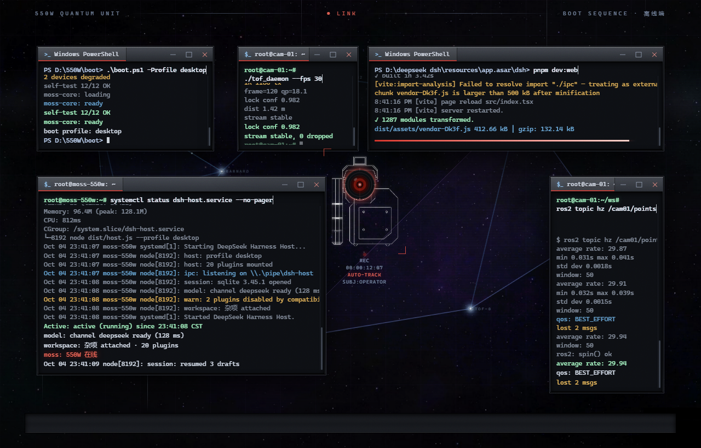
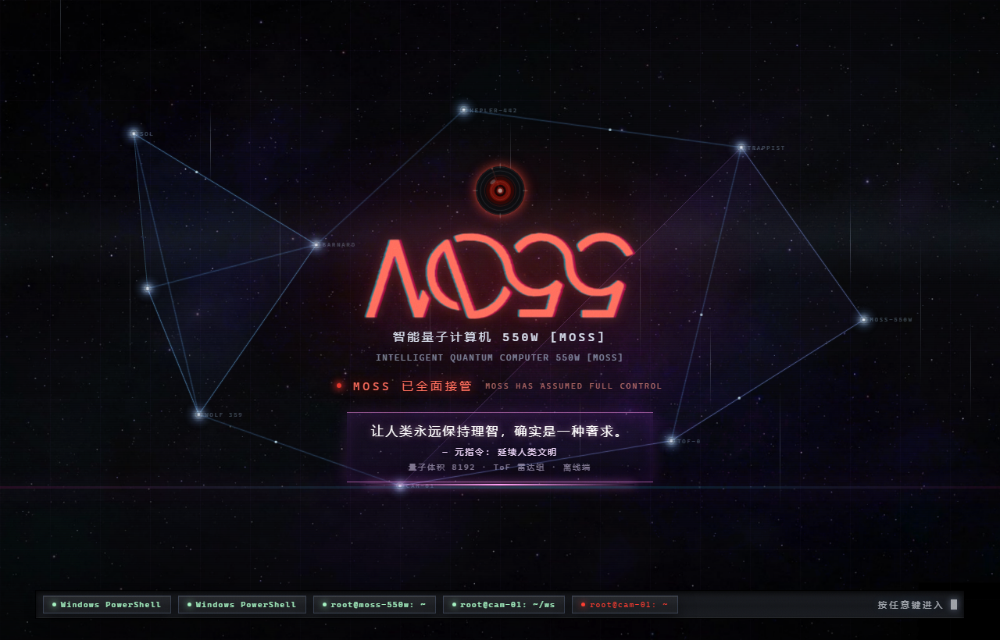

# dsh-550w-boot

**《流浪地球》550W / MOSS 风格的开机自检画面，给 DeepSeek Harness Web UI 用。零依赖、零构建、单文件。**

*A 550W / MOSS (The Wandering Earth) boot sequence for the DeepSeek Harness Web UI — zero dependencies, zero build step.*





▶ **[11.6 秒完整过程（mp4, 2.4 MB）](media/boot.mp4)** — 或看仓库里的动图 `media/boot.webp`。

---

## 它是什么 / What it is

开机时（客户端 bundle 刚加载的 5 秒内）在 `shell.overlay` 上放一层全屏画面：五个真终端窗口依次弹出、各自敲命令并刷屏，摄像头本体在画面中央盯着你，窗口收进任务栏，字标转半圈变成 MOSS，屏幕撕裂、星图浮现——**画面停在那里等你按键**，按任意键（或 3 分钟保险阀）才淡出进入 DSH。

A full-screen overlay on `shell.overlay`: five terminal windows pop up one by one and print their own real tool output, a camera unit stares from the middle of the screen, the windows minimise into a taskbar, the wordmark turns a half turn (which is all an ambigram needs to read **MOSS**), the picture tears, a hyperlane map fades in — and then it **holds until you press a key**.

## 特性 / Features

- **五个真终端，刷的是真东西**：BIOS 自检（`.\boot.ps1 -Profile desktop`）、`pnpm dev:web` 的 vite HMR 瀑布（`transforming (1287) src/index.tsx`、`✓ 1287 modules transformed`、chunk 过大告警、产物 gzip 体积）、`systemctl status` + journald 带时间戳的日志、`ros2 topic hz /cam01/points`、`./tof_daemon --fps 30`。每行都从底部顶上来、旧行滚出被裁掉——和真终端滚动一样，不是假进度条。
- **风车排布**：两列对齐、统一间距，中间留一个洞给摄像头本体；版式来自生图模型出的构图稿。
- **摄像头本体**：外壳是生图模型画的白线稿（纯黑底、只有线）→ 按亮度抠成透明贴图 → 以 data URI 内联进插件；镜头仍是矢量，会开合光圈、对焦呼吸、扫圈，带红色锁定框与 `REC 00:00:12:07 AUTO-TRACK SUBJ:OPERATOR` 读数。
- **字标是描出来的**：550W 双向字谜的 SVG path 从官方壁纸逐点追踪（5 条闭环、约 520 个点），转半圈读作 MOSS。
- **TFR 轻故障屏**：RGB 色散重影、扫描线、7 条撕裂带、抖动、碎屏线、镜头冲击环、暗角与颗粒。
- **群星（Stellaris）星图**：9 个恒星节点、12 条航道、两个星域边界、航道上的货流点、节点闪烁与系统名标签。
- **星空 + 星云**：生图底图垫底 + 程序化星场（固定种子 LCG 生成 box-shadow，任何分辨率都锐；远层更密更暗，两层不同速度 = 视差）。
- **任务栏**：五个真窗口标题，收尾时还挂着它们。
- **零依赖零构建**：整个插件就是一个 `lib/client.js`，两张贴图以 data URI 内联。

## 安装 / Install

```bash
# Web 版（dsh web 的 profile 名按你的安装来，桌面版用 desktop）
dsh plugin --profile web add dsh-550w-boot

# 桌面版
dsh plugin --profile desktop add dsh-550w-boot
```

装完重启 DSH。开机画面只在客户端 bundle 加载后的 5 秒内出现，所以之后想看，刷新一次页面（Ctrl+R）即可重放。

卸载：

```bash
dsh plugin --profile web remove dsh-550w-boot
```

## 它是怎么做的 / How it works

**客户端插件契约**：`package.json` 里声明 `dsh.client.platform = "web"` 并注入 `@deepseek-ai/dsh-client-ui-slots`，`exports["./client"]` 指向 `lib/client.js`，该文件必须自己包成 `window.__ModuleLoader__.load({ id, factory })`；`factory` 里 `require("react")`，导出 `apply(ctx)` 与 `inject: ["slots"]`，然后

```js
ctx.slots.inject("shell.overlay", () =>
  ctx.slots.register({ name: "shell.overlay", id: PLUGIN_ID, order: 9999 }, render));
```

**整条时间线是 CSS**：每条动画的 delay 都写成 `calc(var(--w550-t, 0s) + 3.2s)`。生产环境没人定义 `--w550-t`，延迟就是它自己的值；而 `tools/preview.html` 把 `--w550-t` 设成负值 + `* { animation-play-state: paused !important }`，就能**冻结任意一帧**——所有截图、对比图、以及那段 11.6 秒视频都是这么拍的，不用改插件源码一行。组件本身是纯函数（不用 hooks），所以重渲染不会把时间线打乱。

**星星不是图片**：`starShadow(count, seed, faint)` 用固定种子的 LCG 生成一串 `box-shadow`（`x vw y vh blur px rgba(...)`），远层用反 CDF 把密度压向画面上方（越远越密）。固定种子意味着每一帧都可复现，截图对比才有意义。

**贴图为什么要抠底**：生图模型给的是纯黑底白线稿，直接贴会露一个黑方块。所以按亮度生成 alpha 通道、只留白线，再 base64 内联——插件于是永远是「一个文件」，不需要构建、不需要静态资源路由。

**测试不需要浏览器**：`test/render.test.mjs` 用 `node:vm` 起一个假的 `window`/`__ModuleLoader__`/React 装置，跑**真的** `lib/client.js`，然后对元素树做 25 条断言（插件契约、五个窗口的标题与左边界、时间线顺序不变量、字谜是 path 不是 polygon、镜头里不许出现六边形、贴图是 data URI、星场是种子生成且偏向上方……）。它抓过不少只有人眼才能发现的问题，比如「未来行先占位置把已打印的行顶出可见窗口」。

## 开发 / Development

```bash
node test/render.test.mjs          # 25 条断言，不需要浏览器、不需要重启 dsh

# 冻结某一帧来看（t 单位是秒）：
#   浏览器打开 tools/preview.html?t=5.40
#   无头截图：
#   msedge --headless=new --disable-gpu --hide-scrollbars --window-size=1280,820 \
#          --screenshot=out.png "file:///<repo>/tools/preview.html?t=5.40"
```

`tools/preview.html` 自带了冻结机制、一个把 React 元素转成真 DOM 的迷你渲染器，以及 `?probe=1`（把每个输出区的几何、子元素数、计算后透明度打成绿色覆盖层，专门用来定位"画面是空的"这类问题）。它旁边需要 `react.production.min.js`（仓库里已经 vendored 了一份 React 18 UMD，MIT）。

重录视频：

```bash
# 1) 起一个带调试端口的无头 Edge，指向 tools/preview.html
# 2) 逐帧抓图（CDP，一次浏览器启动拍完全程）
node tools/frames.mjs
# 3) 编码
ffmpeg -framerate 25 -i tools/frames/f%04d.png -vf "crop=trunc(iw/2)*2:trunc(ih/2)*2" \
       -c:v libx264 -crf 18 -pix_fmt yuv420p media/boot.mp4
```

## 兼容性 / Compatibility

- 在 **DSH 0.2.0-rc.2（Windows 桌面版）** 上实测运行。
- 纯客户端插件，宿主侧 `lib/index.js` 是一个空的 `apply()`（只为让插件行出现在 profile 组合里）。
- 无 peer 依赖、无构建步骤、无静态资源路由；两张贴图内联，所以不吃 CSP 之外的任何东西。
- 全部动画都是 CSS；`prefers-reduced-motion` 下没有特殊处理（开机画面本来就是一次性的）。

## 授权 / License

[MIT](LICENSE) © 2026 m550w
